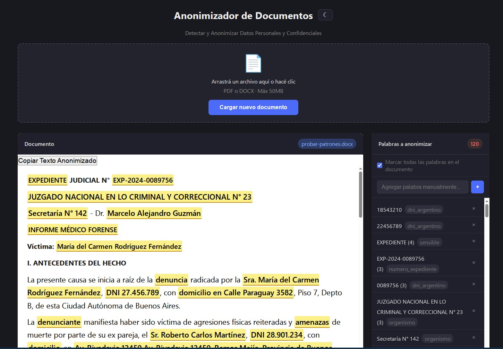

# 🕵️ Anonimizador de Documentos

Aplicación web para detectar y anonimizar datos personales en documentos PDF y DOCX. Combina detección por reglas (regex configurables) con análisis por IA vía **OpenCode** para identificar información sensible como nombres, DNI, direcciones, montos de dinero, palabras jurídicas y más, y luego exporta el documento anonimizado o copia el texto al portapapeles.

   


*Documento Simulado*

---

## ✨ Características

- **Carga drag & drop** de archivos PDF y DOCX (máx 50 MB)
- **Detección en dos capas**:
  - **Regex configurable**: 29 patrones editables desde el panel admin — DNI argentino, direcciones, edad, sexo, nombres, emails, y palabras sensibles (`abus*`, `viol*`, `homicid*`, `femicid*`, `forens*`, `expedient*`, etc.)
  - **IA**: vía **OpenCode** con prompts personalizables, usando cualquier modelo LLM compatible OpenAI
- **Interfaz interactiva**:
  - Documento renderizado con palabras PII resaltadas en **amarillo**
  - Click para agregar/quitar palabras de la lista de anonimización
  - Checkbox "Marcar todas" para togglear todas las ocurrencias de una palabra
  - Agregar palabras manualmente desde el panel lateral
  - **Copiar Texto Anonimizado** al portapapeles (ideal para chatbots)
  - **Ver Razonamiento** de la IA en modal
  - Tema oscuro/claro con persistencia en localStorage
- **Exportación** del documento anonimizado en:
  - **DOCX** (reemplaza palabras preservando mejor runs, negritas, itálicas y estructura básica)
  - **PDF** (genera nuevo documento con tipografía DejaVu; si el origen es DOCX, respeta mejor headings, listas y tablas básicas)
  - *Nota*: PDFs originales solo pueden exportarse a PDF (python-docx no abre PDFs)
- **Panel de Administración** (acceso discreto ⚙ esquina inferior izquierda):
  - Login con credenciales configurables en `.env`
  - **Prompt**: editar el prompt que se envía a la IA
  - **Patrones Regex**: editar los patrones de detección en formato JSON
  - **Elegir Modelo**: configurar API endpoint URL, nombre del modelo, API key y comando completo de opencode (soporta modelos locales/remotos como Ollama y experimentación de flags), con botón para guardar y botón para probar inferencia
  - **API Directa**: habilitar detección IA vía HTTP directa al endpoint OpenAI-compatible (sin opencode), con campos propios, botón de guardar, botón de prueba de conexión y visor de logs
  - **Restaurar config**: botón que recupera Prompt y Patrones Regex a defaults sin modificar modelo ni API Directa
- **Normalización Unicode**: maneja acentos correctamente (Pérez ↔ Perez)
- **Corre en Docker Compose** con un solo comando
- **Listo para balanceo/HA**: endpoint `/ready` para que HAProxy detecte instancias ocupadas

---

## 🚀 Instalación y uso

### Requisitos

- Docker y Docker Compose v2
- Una API key de un proveedor LLM ([OpenRouter](https://openrouter.ai), [Together AI](https://together.ai), etc.)

### Pasos

```bash
# 1. Clonar el repositorio
git clone https://github.com/tu-usuario/anonimizador.git
cd anonimizador

# 2. Iniciar
docker compose up --build

# Nota: si no existe .env, la app lo crea automáticamente desde .env.example en el arranque.
```

La aplicación estará disponible en `http://localhost:5000`.

Verificacion rapida:

```bash
curl -s http://localhost:5000/ready
```

Si algo falla:

```bash
docker compose ps
docker compose logs --tail=200 web redis
```

### Variables de entorno

| Variable | Descripción | Ejemplo |
|---|---|---|
| `OPENAI_API_KEY` | API key del proveedor LLM | `sk-or-v1-...` |
| `OPENAI_BASE_URL` | URL base del proveedor | `https://openrouter.ai/api/v1` |
| `MODEL_NAME` | Modelo a usar (formato provider/modelo) | `opencode/deepseek-v4-flash-free` |
| `FLASK_PORT` | Puerto del servidor | `5000` |
| `ADMIN_USER` | Usuario del panel admin | `adminanon` |
| `ADMIN_PASS` | Contraseña del panel admin | `cambiar-esta-clave` |
| `FLASK_SECRET_KEY` | Secret key para sesiones Flask | `cualquier-string-seguro` |
| `SESSION_COOKIE_SECURE` | Cookie segura de sesión (`0` local HTTP, `1` prod HTTPS) | `0` |
| `SESSION_BACKEND` | Backend de sesiones (`redis` o `cookie`) | `redis` |
| `REDIS_URL` | URL de Redis compartido (single/HA) | `redis://redis:6379/0` |
| `REDIS_CONFIG_KEY` | Key Redis para config compartida | `anonimizador:config` |
| `READY_MAX_INFLIGHT` | Umbral de requests concurrentes para marcar busy en `/ready` | `2` |
| `UPLOAD_TTL_SECONDS` | Tiempo de retención de uploads con PII (segundos) | `86400` |
| `LOGIN_WINDOW_SECONDS` | Ventana de rate limit login admin (segundos) | `300` |
| `LOGIN_MAX_ATTEMPTS` | Máximo de intentos de login por ventana | `5` |
| `LOCAL_INFERENCE_MAX` | Máximo de inferencias simultáneas en proveedor local | `3` |
| `LOCAL_INFERENCE_WAIT_SECONDS` | Espera máxima de slot local en `/upload` | `90` |
| `LOCAL_INFERENCE_POLL_SECONDS` | Polling para tomar slot local | `1.5` |
| `LOCAL_INFERENCE_SLOT_TTL_SECONDS` | TTL de seguridad del slot local en Redis | `180` |
| `MAX_UPLOAD_MB` | Tamaño máximo de subida en MB | `100` |
| `OCR_MAX_PAGES` | Máximo de páginas a procesar con OCR | `50` |
| `OCR_DPI` | Resolución para conversión de PDF a imagen | `200` |
| `OCR_LANG` | Idioma de Tesseract OCR | `spa` |

### Sin Docker

```bash
pip install -r requirements.txt
npm install -g opencode-ai@latest
./entrypoint.sh
```

---

## 🧠 Arquitectura

```
anonimizador/
├── app.py                  # Backend Flask (API endpoints, detección PII, export, admin)
├── entrypoint.sh           # Configura opencode auth.json al iniciar
├── regex_patterns.json     # Patrones regex + prompt + config modelo (editable desde admin)
├── templates/
│   └── index.html          # Frontend HTML (SPA)
├── static/
│   ├── style.css           # CSS con tema oscuro/claro + admin panel
│   └── app.js              # Lógica frontend: upload, PII toggle, export, copy, admin
├── docker-compose.yml      # Orquestación Docker
├── docker-compose.ha.yml   # HA completo: haproxy + 5 instancias activas + redis
├── haproxy.cfg             # Config base para HAProxy en host
├── haproxy.ha.cfg          # Config para HAProxy dentro de Docker Compose HA
├── haproxy-503.http         # Pagina 503 de espera con refresh cada 10s
├── HAPROXY.md              # Guia de balanceo y health checks
├── OPERACION-HA.md         # Runbook single-instance + HA
├── TESTING.md              # Documentación completa de tests (qué testea y qué NO)
├── testing/                # 221 tests: unitarios, seguridad, calidad + smoke bash
├── .github/workflows/      # CI: unit-tests.yml + smoke-tests.yml
├── Dockerfile              # python:3.11-slim + Node.js 22 + opencode-ai
├── requirements.txt        # Dependencias Python
├── .env                    # Configuración sensible
└── .env.example            # Plantilla de configuración
```

### Flujo de procesamiento

1. **Upload** → se extrae el texto del PDF/DOCX preservando títulos, párrafos y listas
2. **Detección regex** → patrones desde `regex_patterns.json` buscan DNI, direcciones, edad, sexo, nombres, emails, palabras sensibles
3. **Detección IA** → el texto se envía a **OpenCode** (`opencode run --model ...`) que analiza y devuelve palabras PII adicionales con categorías
4. **Combinación** → se fusionan posiciones sin duplicados y se devuelven al frontend
5. **Interacción** → el usuario revisa, agrega o quita palabras, puede copiar el texto anonimizado
6. **Exportación** → se reemplazan las palabras seleccionadas con `[REDACTADO]` y se descarga el documento
   - DOCX: se anonimiza sobre el documento original para preservar formato
   - PDF desde DOCX: se renderiza directamente desde el DOCX para evitar pérdida innecesaria de estructura
   - El archivo subido se conserva hasta el TTL de limpieza, por lo que se puede exportar más de una vez en formatos distintos sobre el mismo análisis

### API REST

| Endpoint | Método | Descripción |
|---|---|---|
| `/` | GET | Frontend web |
| `/upload` | POST | Subir PDF/DOCX (multipart `file`) |
| `/reanalyze-ai` | POST | Reintentar analisis IA sobre upload existente (`{filename}`) |
| `/export` | POST | Exportar documento anonimizado (JSON body) |
| `/ready` | GET | Estado de disponibilidad para balanceadores (200 libre / 503 busy) |
| `/admin/login` | POST | Login panel admin |
| `/admin/logout` | POST | Logout panel admin |
| `/admin/status` | GET | Estado de sesión admin |
| `/admin/config` | GET | Obtener config (patrones, prompt, modelo, API key, comando opencode, modo API directa) |
| `/admin/config` | POST | Guardar config |
| `/admin/test-api` | POST | Probar conectividad endpoint API directa |
| `/admin/test-inference` | POST | Probar inferencia con prompt de ejemplo |
| `/admin/api-logs` | GET | Ver registros de llamadas API directa |
| `/admin/config/restore-defaults` | POST | Restaurar Prompt y Patrones Regex a defaults (sin tocar modelo) |

#### `/upload` response

```json
{
  "filename": "uuid.docx",
  "segments": [
    {"type": "title", "text": "Informe"},
    {"type": "paragraph", "text": "Paciente: Juan Pérez, DNI 30.123.456"}
  ],
  "keywords": [
    {"word": "Juan Pérez", "type": "nombre"}
  ],
  "default_keywords": [
    {"word": "30.123.456", "type": "dni_argentino"}
  ],
  "positions": [
    {"segment": 1, "start": 12, "end": 22, "word": "Juan Pérez", "type": "nombre"}
  ],
  "reasoning": "Output completo de la IA...",
  "queue_notice": "Inferencia local en cola...",
  "ai_status": "ok",
  "analysis_mode": "full"
}
```

Valores posibles de `ai_status`: `ok`, `busy`, `unavailable`, `timeout`, `error`.

Cuando `analysis_mode` es `regex_only`, el frontend habilita `Reintentar con IA` y usa `/reanalyze-ai` con polling cada 5s.

#### `/export` request

```json
{
  "filename": "uuid.docx",
  "keywords": [
    {"word": "Juan Pérez", "type": "nombre"},
    {"word": "30.123.456", "type": "dni_argentino"}
  ],
  "format": "docx",
  "replacement": "[REDACTADO]"
}
```

---

## 🔍 Detección regex (configurable)

Patrones por defecto en `regex_patterns.json` (editables desde el panel admin):

| Tipo | Patrón | Ejemplo |
|---|---|---|
| DNI argentino | `\b\d{1,2}\.?\d{3}\.?\d{3}\b` | `30.123.456` |
| DNI sin puntos | `\b\d{7,8}\b` | `30123456` |
| Dirección | `(?:calle\|av\.|avenida\|domicilio...) + texto + número` | `Av. Siempre Viva 742` |
| Edad | `\d+\s*(?:años\|anios\|años de edad)` | `45 años` |
| Sexo | `\b(?:masculino\|femenino\|varón\|mujer...)\b` | `Masculino` |
| Nombre | `(?:paciente\|nombre\|Sr.\|Sra....) + nombre + apellido` | `Paciente: Carlos Martínez` |
| Email | `\b[\w.-]+@[\w.-]+\.\w{2,}\b` | `juan@mail.com` |
| Sensibles | `abus\w*`, `viol\w*`, `fallec\w*`, `homicid\w*`, `femicid\w*`, `lesion\w*`, `amenaz\w*`, `agred\w*`, `imput\w*`, `conden\w*`, `deten\w*`, `testig\w*`, `denunci\w*`, `perici\w*`, `forens\w*`, `cadav\w*`, `autops\w*`, `necrops\w*`, `identif\w*`, `domicil\w*`, `document\w*`, `expedient\w*` | `abuso`, `homicidio`, `forense` |

---

## ⚙️ Panel de Administración

Acceso: botón ⚙ en la esquina inferior izquierda.

### Credenciales

Configurables en `.env`:
- `ADMIN_USER=adminanon`
- `ADMIN_PASS=cambiar-esta-clave`

### Tabs

1. **Prompt**: Editor del prompt que se envía a la IA. Usa `{text}` como placeholder para el texto del documento.
2. **Patrones Regex**: Editor JSON de los patrones de detección. Formato: `[{"pattern": "regex", "type": "categoria"}, ...]`
 3. **Elegir Modelo**: Configurar el modelo LLM:
    - **API Endpoint URL**: URL base del proveedor (ej: `https://openrouter.ai/api/v1` o `http://localhost:11434/v1` para Ollama)
    - **Nombre del modelo**: Formato `provider/modelo` (ej: `opencode/deepseek-v4-flash-free`)
    - **API Key**: clave del proveedor para ese endpoint/modelo (si se deja vacía, usa `OPENAI_API_KEY` del entorno)
    - **Comando opencode**: línea de comando completa (usa placeholders `{message}`, `{model}`, `{file}`)
    - **Guardar configuración**: persiste los cambios del modelo/opencode
    - **Probar inferencia**: ejecuta `hola, explica tu capacidades` y abre un popup con la respuesta
 4. **API Directa**: Control del modo de llamada HTTP directa:
    - **Campos propios**: `API Endpoint URL`, `Nombre del modelo` y `API Key`
    - **Guardar configuración**: persiste los campos del tab
    - **Checkbox**: habilitar/deshabilitar modo API directa (por defecto usa opencode)
    - **Probar conexión**: llama al endpoint `{model_url}/chat/completions` con un mensaje de prueba
    - **Ver logs**: muestra las últimas llamadas API con timestamp, URL, modelo, duración y preview

> Nota: el botón **Restaurar config por defecto** (al pie del panel) recupera Prompt y Patrones Regex a valores de fábrica sin modificar la configuración de Elegir Modelo ni API Directa.

> Nota: para configurar **Ollama remoto privado** (servidor propio con endpoint OpenAI-compatible), ver ejemplo completo y recomendaciones en `OLLAMA.md`.

Los cambios se aplican inmediatamente al siguiente documento cargado.

---

## ⚖️ HA / Balanceo

La app expone `GET /ready` para integración con HAProxy o balanceadores similares.

- `200`: instancia disponible
- `503`: instancia ocupada (busy)

El umbral se controla con `READY_MAX_INFLIGHT`.

Configuración ejemplo y parámetros recomendados: `HAPROXY.md`.
Runbook operativo (single + HA): `OPERACION-HA.md`.

Si todas las instancias backend quedan no disponibles, HAProxy responde una pagina 503 personalizada (`haproxy-503.http`) con reintento automatico cada 10 segundos.

Además se incluye `docker-compose.ha.yml` listo para levantar HA end-to-end:

- `haproxy` incluido en el mismo compose (app en `http://localhost:8081`, stats en `http://localhost:8404/stats`)
- `web1..web5` activas por default (tambien expuestas en `5001..5005` para debug)
- `web6..web10` comentadas para habilitar escalado a 10
- `redis` único y compartido para sesión admin + rate limit + config distribuida

Arquitectura recomendada en HA:

- Público (`/upload`, `/export`): `leastconn` + `/ready` + afinidad por IP para conservar archivos temporales del flujo upload/export
- Admin (`/admin/*`): sticky sessions vía cookie de backend

Levantar pool HA por default (5 instancias):

```bash
docker compose -f docker-compose.ha.yml up --build -d
```

### Quickstart HA (usuario nuevo)

Pasos minimos para que funcione al clonar el repo:

```bash
# 1) Clonar
git clone https://github.com/tu-usuario/anonimizador.git
cd anonimizador

# 2) Levantar stack HA completo (haproxy + web1..web5 + redis)
docker compose -f docker-compose.ha.yml up --build -d

# Nota: si no existe .env, la app lo crea automáticamente desde .env.example en el arranque.
```

Prechecks recomendados (puertos libres en host):

- `8081` (app balanceada)
- `8404` (stats HAProxy)
- `6379` (Redis)
- `5001..5005` (instancias web publicadas para debug)

Verificacion rapida:

```bash
curl -s http://localhost:8081/ready
curl -s http://localhost:8404/stats
```

Si algo falla:

```bash
docker compose -f docker-compose.ha.yml ps
docker compose -f docker-compose.ha.yml logs --tail=200 haproxy web1 web2 web3 web4 web5 redis
```

Notas:

- Si `8081` esta ocupado y queres `:80`, cambia el mapeo del servicio `haproxy` en `docker-compose.ha.yml` (por ejemplo `80:80`).
- La afinidad por IP en HAProxy mantiene el flujo `/upload` -> `/export` en la misma instancia para encontrar el archivo temporal.
- Para proveedor local (ej: Ollama), si no hay slot de inferencia, la UI muestra popup `Proveedor ocupado, en espera`, permite `Continuar sin IA` y deja disponible `Reintentar con IA`.

Probar endpoints del balanceador:

```bash
curl -s http://localhost:8081/ready
curl -s http://localhost:8404/stats
```

---

## 🧪 Testing

El proyecto tiene **221 tests** en 3 categorías. Detalle completo en [TESTING.md](TESTING.md).

### Qué se testea

| Tipo | Tests | Qué cubre |
|---|---|---|
| **Unitarios** | 130 | Regex PII, parser de IA, Unicode, reemplazo, filenames, config admin, export DOCX/PDF |
| **Seguridad** | 34 | Archivos no permitidos, path traversal, rate limit login, cookies seguras, auth admin |
| **Calidad** | 46 | Documentos sintéticos con DNI, CUIL, nombres, domicilios, expedientes, víctimas, imputados, menores, delitos sexuales, violencia, fallecimientos, organismos judiciales |
| **Smoke (E2E)** | 2 scripts | Stack single y HA completo (upload → export) |

### Qué NO se testea

- **IA real**: los tests unitarios no invocan opencode ni LLMs externos
- **Frontend**: no hay tests de JavaScript/UI (solo backend)
- **Documentos escaneados**: cubierto de forma básica por `test_export_pdf.py::test_anonymize_pdf_scanned_pdf_ocr_fallback` (valida fallback OCR y export). No cubre benchmarking ni alta variedad de escaneos.
- **Rendimiento**: no hay tests de carga ni benchmarks
- **HA distribuido**: rate limit y sesiones se testean en 1 instancia, no en pool HA

### Ejecutar tests

```bash
# Todos los tests (~2s)
docker compose run --rm -e SESSION_BACKEND=cookie web pytest testing/ -v

# Solo una categoría
docker compose run --rm -e SESSION_BACKEND=cookie web pytest testing/test_security.py -v

# Smoke tests E2E (levantan Docker)
./testing/run_all.sh
```

### CI

Dos workflows de GitHub Actions:

| Workflow | Jobs | Tiempo | Trigger |
|---|---|---|---|
| `unit-tests.yml` | unitarios, seguridad, calidad (paralelos) | ~10s | push, PR, manual |
| `smoke-tests.yml` | single, HA | 5-10 min | push, PR, manual |

---

## 🛠️ Tecnologías

| Tecnología | Uso |
|---|---|
| **Python 3.11** | Backend |
| **Flask 3.1** | Framework web |
| **Gunicorn** | Servidor WSGI (2 workers, timeout 180s) |
| **pdfplumber** | Extracción de texto de PDFs |
| **python-docx** | Extracción y generación de DOCX |
| **fpdf2** | Generación de PDFs |
| **OpenCode** | Agente IA para detección de PII vía CLI |
| **Node.js 22** | Runtime para OpenCode |
| **Docker Compose** | Orquestación de servicios |
| **JavaScript vanilla** | Frontend SPA interactivo |

---

## 📄 Licencia

MIT
